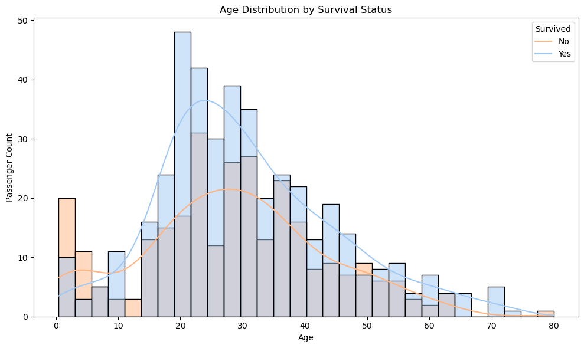
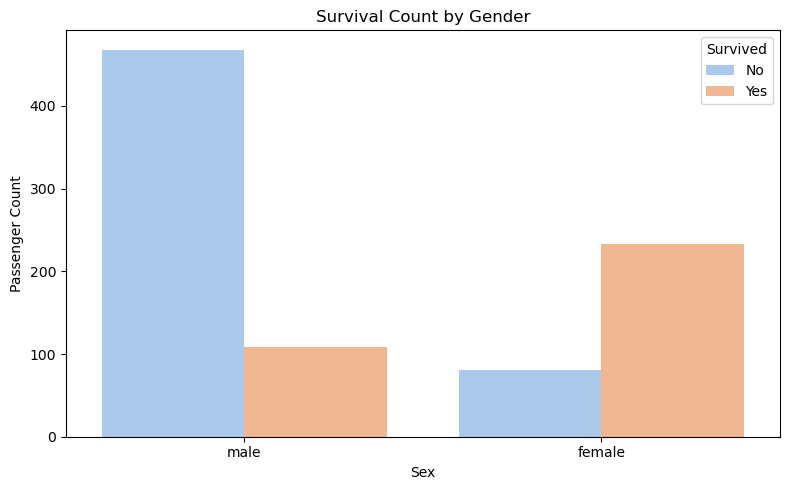
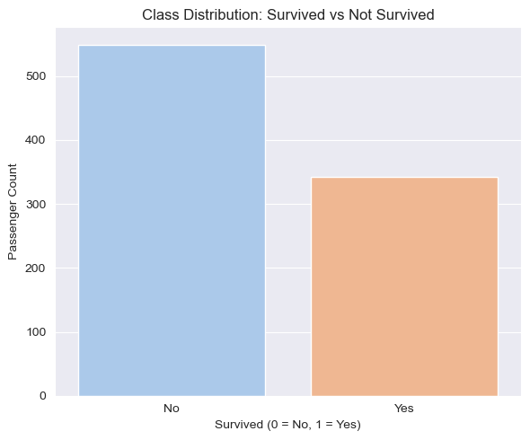

# Titanic Survival Prediction

A machine learning project that predicts passenger survival on the Titanic using real historical data. This project includes data exploration, feature engineering, and model building using a complete Scikit-learn pipeline with hyperparameter tuning via cross-validation.

---
## Dataset

The dataset used in this project is the Titanic passenger dataset, available through the Seaborn library. It contains information about passenger demographics, ticket class, fare paid, and whether they survived the disaster.

- Source: [Seaborn Titanic Dataset](https://github.com/mwaskom/seaborn-data/blob/master/titanic.csv)
---
## Project Overview

This repository demonstrates how to use structured data to train a classification model that predicts whether a passenger would have survived the Titanic disaster. In addition to building a predictive model, this project extracts meaningful insights from the data, reflecting real-world patterns such as age, gender, and social class.

---
## Feature Engineering

The following features were selected as inputs to the model:

- `pclass`, `sex`, `age`, `sibsp`, `parch`, `fare`, `class`, `who`, `adult_male`, `alone`

Numerical features such as `age` and `fare` were scaled, and missing values were imputed using median values. Categorical variables were one-hot encoded to transform them into numerical format compatible with machine learning models.
---
## Table of Contents

- [Project Overview](#project-overview)
- [Dataset](#dataset)
- [Exploratory Data Analysis](#exploratory-data-analysis)
- [Feature Engineering](#feature-engineering)
- [Modeling](#modeling)
- [Evaluation](#evaluation)
- [Insights and Conclusions](#insights-and-conclusions)

## Modeling

To predict passenger survival, a supervised classification approach was implemented using a **Random Forest Classifier**, integrated into a complete machine learning pipeline. The pipeline includes:

- Handling missing values (imputation)
- Feature scaling for numerical features
- One-hot encoding for categorical variables
- Hyperparameter tuning using `GridSearchCV`

The dataset was split into **80% training** and **20% testing**, maintaining class balance with `stratify=y`. Cross-validation was performed using **StratifiedKFold (5 folds)** to ensure stability in the evaluation.

## Model Used
- **Algorithm:** Random Forest Classifier
- **Cross-validation:** 5-fold StratifiedKFold
- **Hyperparameters Tuned:**  
  - `n_estimators` = 50, 100  
  - `max_depth` = None, 10, 20  
  - `min_samples_split` = 2, 5

## Exploratory Data Analysis

Before building the model, an exploratory data analysis (EDA) was performed to understand the structure and distribution of the dataset. This step helps identify missing values, outliers, correlations, and patterns that may influence survival.

### Age Distribution by Survival

The distribution shows that younger passengers had a higher chance of survival. This aligns with the prioritization of children during evacuation.

### Survival Rate by Gender

Female passengers had a significantly higher survival rate compared to males, which supports historical accounts that women and children were prioritized during lifeboat boarding.

### Class Distribution

The class distribution shows that approximately 62% of the passengers did not survive, while 38% survived. This moderate class imbalance was taken into account by using stratified cross-validation during model evaluation.

## Insights and Conclusions

- Passengers who paid higher fares and belonged to higher classes had a significantly greater chance of survival.
- Female passengers had much higher survival rates compared to males.
- Children and younger individuals were more likely to survive, reflecting the “women and children first” policy during the evacuation.
- Despite a moderate class imbalance, the model achieved good generalization performance with 81% accuracy on the test set.

This project demonstrates how machine learning can uncover real-world patterns and support historical facts through data.
